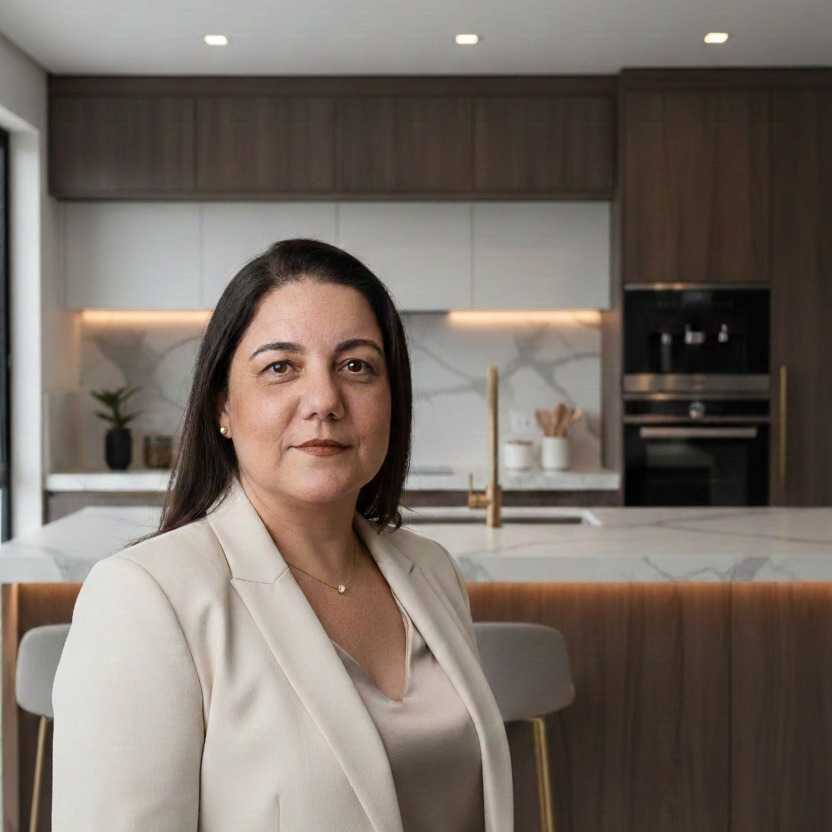

# 🏛️ Keler Tiussi — Designer de Interiores

<p align="center">
  
</p>

<p align="center">
  <b>Design que transforma. Planejamento que economiza.</b><br>
  Plataforma oficial da designer Keler Tiussi — Especialista em Arquitetura de Interiores e Projetos de Luxo com mais de 20 anos de atuação e 5.000+ projetos realizados.
</p>

<p align="center">
  <a href="https://kelertiussi.com.br" target="_blank">🌐 kelertiussi.com.br</a> •
  <a href="#-sobre-o-projeto">Sobre</a> •
  <a href="#-tecnologias-e-design">Tecnologias</a> •
  <a href="#-funcionalidades-de-alta-performance">Funcionalidades</a> •
  <a href="#-estrutura-de-arquivos">Arquitetura</a>
</p>

---

## 🌟 Sobre o Projeto

O site oficial da **Keler Tiussi** é uma aplicação web *Single Page* concebida sob a metodologia **Editorial Organicism**, combinando estética minimalista de alto luxo, navegação fluida e foco em conversão para atendimento VIP via WhatsApp.

Desenvolvido para representar a marca no domínio oficial [kelertiussi.com.br](https://kelertiussi.com.br), o projeto transmite autoridade, elegância e segurança técnica para clientes que buscam projetos residenciais e comerciais personalizados.

---

## 📸 Prévia do Projeto

<p align="center">
  
  
</p>

---

## 🛠️ Tecnologias & Design System

- **HTML5 Semântico & SEO:** Estrutura otimizada para buscadores (Google, Bing) e suporte a integração de anúncios (Meta Pixel).
- **CSS3 Vanilla (Design Tokens):**
  - Sistema de cores *Editorial Organicism* com paleta de verdes terrosos e naturais (`--primary: #4e5933`), fundos orgânicos (`#F9F9F7`) e tipografia refinada com Google Fonts (*Noto Serif* e *Manrope*).
  - Efeitos translúcidos (*glassmorphism*) com `backdrop-filter: blur(24px)`.
  - Transições suaves e responsividade completa via CSS Grid e Flexbox.
- **JavaScript Pure (ES6+):**
  - **Carrossel Interativo de Portfólio:** Slider dinâmico com navegação por setas, indicação visual e suporte a touch/drag.
  - **Lazy Loading Inteligente via `IntersectionObserver`:** Carregamento sob demanda de vídeos e mídias pesadas apenas quando visíveis na tela, reduzindo consumo de dados e acelerando a abertura da página.
  - **Web Share API Integrada:** Sistema de compartilhamento de projetos individuais via URL parametrizada (`?projeto=X`) com cópia automática para a área de transferência.

---

## ✨ Funcionalidades de Alta Performance

- 📱 **Mobile-First & Menu Overlay:** Menu responsivo personalizado para smartphones e tablets.
- 🎬 **Hero Imersivo com Vídeo Moodboard:** Apresentação da marca com vídeo institucional contínuo em loop nativo.
- 📐 **Sessão "Nossa Essência":** Apresentação dos pilares do escritório (*Identidade*, *Funcionalidade* e *Planejamento*).
- 🏷️ **Tabela Transparente de Serviços:** Seções explicativas e detalhamento das etapas dos projetos online e presenciais.
- 💬 **Gatilho de Conversão Direta:** Botão flutuante WhatsApp (FAB) presente em todas as seções para agendamento imediato.

---

## 📁 Estrutura de Arquivos

```text
├── index.html                  # Aplicação Single Page Master (HTML + CSS + JS)
├── README.md                   # Documentação institucional do repositório
└── assets/                     # Acervo de mídias e portfólio
    ├── Geral/                  # Logos, perfis e vídeos institucionais
    ├── Portfólio/              # Mídias da galeria geral
    ├── Projeto B/              # Fotos e vídeos do projeto "Ambiente Inspirador"
    ├── Projeto E/              # Fotos e vídeos do projeto "Home Theater Botânico"
    └── Projeto F/              # Fotos do projeto "Living Integrado"
```

---

<p align="center">
  Desenvolvido por <b>Kauã Medeiros</b> | <i>Powered by AntiGravity Web Methodology</i>.
</p>
